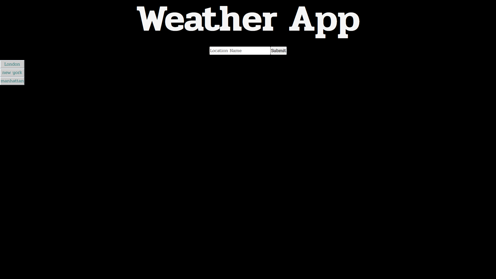
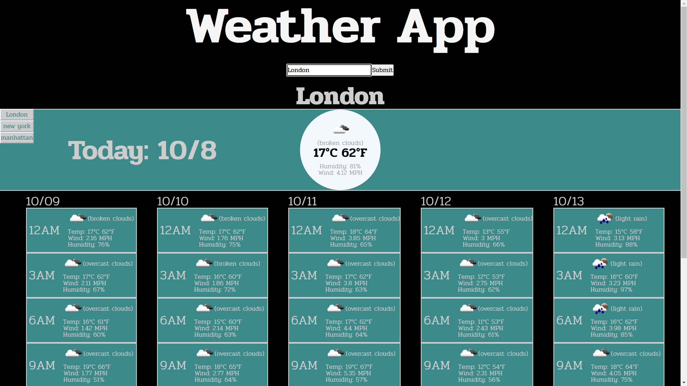
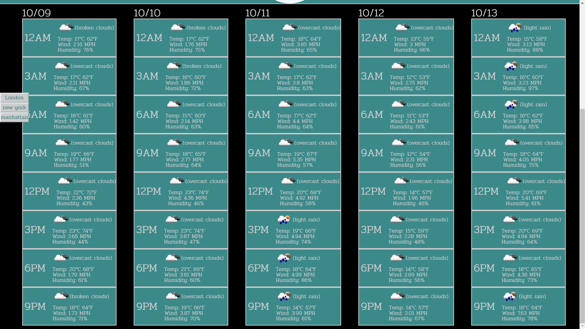

# Weather-App

By Shane Mindreau

[Deployed Weather App](https://smindre1.github.io/Weather-App/)

## Description

This is a weather app that takes a User's searched location and provides that location's current weather conditions and a five day forecast for the location. With each search the app displays dates for each data grouping, icon representations of weather conditions, the temperature as both Fahrenheit and Celsius, the wind speed, and the humidity. _When the location the User looks up is too big of an area, it will provide the weather data for a location within the searched area and provide it's name on screen._

## Table of Contents

- [Installation](#installation)
- [Usage](#usage)
- [Credits](#credits)
- [License](#license)
- [Badges](#badges)
- [Features](#features)
- [How To Contribute](#contribute)
- [Tests](#tests)

## Installation

To install this app for your own usage, you will need to go and create an account on [OpenWeather](https://openweathermap.org/api) and receive an API Key. Take your API Key and replace the value of the old APIKey constant in the script.js file with your personal API Key.

## Usage

To use the app you can input the name of a location like London, New York, Manhattan, etc. and click the search button.

The app will showcase both the current weather data for your searched location at the time of running the search as well as a five day forecast for the location. Each of the five days data is split into 8 increments spread 3 hours apart. A button list will also appear on the left side of the interface. Those buttons are the User's search history, and clicking a button with a prior search will bring that locations weather results back up on display.

## Credits

This app was built completely by **Shane Mindreau** and utilizes the Geo location, Current Weather, and Forecast APIs from [OpenWeather](https://openweathermap.org/api).

## License

MIT License

## Badges

N/A

## Features

- Clicking the enter key after typing your location in the search bar will also run the program. It's an alternate way to run the app instead of having to click the submit button every time.
- A search history section of clickable buttons for each prior User search. By clicking a button it will run it's location through the app again. Any repeated searches, wheither through the search history buttons or search bar will not add a new button if it is already presented as a search history button.
- The location's name and dates are presented for the the user for easy understanding.

## How to Contribute 

If you wish to contribute to this project you can reach out to my personal email: shane27265@gmail.com with a message of what you plan to change or add to improve this app and I can add you as a collaborator via GitHub.

## Tests

There currently are no tests set up for this app's code.
